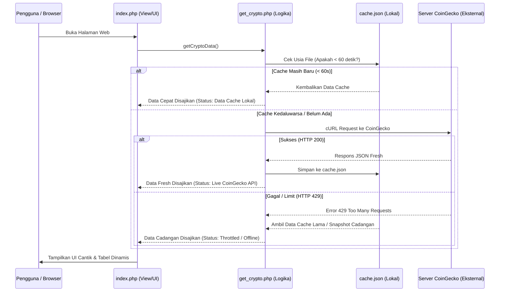

# Panduan & Penjelasan Struktur Proyek: CryptoPulse (Monitoring Crypto API)

Dokumentasi ini dirancang untuk membantu Anda memahami seluruh arsitektur, alur kerja, dan konsep di balik pembuatan aplikasi **CryptoPulse**. Anda dapat menggunakan panduan ini sebagai bahan presentasi atau saat ditanya mengenai cara kerja sistem.

---

## 🏗️ 1. Struktur Direktori Proyek (*File Structure*)

Proyek ini dibangun menggunakan arsitektur **Clean Code (Pemisahan Concern/Tugas)**. Setiap file memiliki tanggung jawab spesifik agar kode rapi, mudah dibaca, dan mudah dikembangkan.

```text
minitoring_crypto/
│
├── 📂 api/
│   ├── 📄 get_crypto.php   <-- Inti Logika: Komunikasi dengan API, cURL, Error Handling & Caching.
│   └── 📄 cache.json       <-- File Sementara: Menyimpan hasil JSON terakhir agar web sangat cepat.
│
├── 📂 css/
│   └── 📄 style.css        <-- Inti Desain: Styling UI/UX dengan estetika Glassmorphism & Dark Mode.
│
└── 📄 index.php            <-- Inti Tampilan (View/UI): Menyatukan data dan menampilkannya ke HTML.
```

---

## ⚙️ 2. Penjelasan Detail Fungsi Setiap File

### A. [`api/get_crypto.php`](file:///c:/laragon/www/minitoring_crypto/api/get_crypto.php) (Bagian Backend / Pengambil Data)
File ini adalah "mesin" yang mengambil mentahan data dari internet. Didalamnya terdapat fungsi `getCryptoData(&$dataSource)` yang melakukan 4 hal utama:
1. **Pengecekan Cache Lokal:** Sebelum meminta data ke server CoinGecko, sistem melihat apakah file `cache.json` sudah ada dan umurnya **di bawah 60 detik**. Jika masih baru, sistem langsung mengembalikan data cache. (Ini membuat web instan dan menghemat kuota API).
2. **Koneksi HTTP Client (cURL):** Melakukan *HTTP GET Request* ke alamat API CoinGecko dengan mengirimkan *User-Agent* dan *Accept Header* agar server CoinGecko mengenali aplikasi kita sebagai peramban/klien yang sah.
3. **Penanganan Error & Limit (*Error Handling 429*):** Apabila server CoinGecko mengalami gangguan atau membatasi IP Anda karena terlalu sering mengakses (*HTTP Code: 429 Too Many Requests*), sistem secara cerdas **tidak akan membiarkan halaman web error/putih**. Sistem otomatis beralih menggunakan data cache terakhir atau data cadangan (*snapshot top 10*).
4. **Menyimpan Cache Baru:** Jika koneksi API sukses (HTTP Code 200), hasil respons JSON disimpan ulang ke dalam file `cache.json` untuk pemakaian berikutnya.

### B. [`api/cache.json`](file:///c:/laragon/www/minitoring_crypto/api/cache.json) (Penyimpanan Sementara)
File berformat JSON yang digenerate otomatis. Berisi data lengkap 10 koin teratas (Bitcoin, Ethereum, dll) mulai dari harga, ranking, volume transaksi, hingga gambar ikon koin.

### C. [`index.php`](file:///c:/laragon/www/minitoring_crypto/index.php) (Bagian Frontend / Antarmuka Pengguna)
File ini adalah wajah dari aplikasi. Alur kerjanya:
1. **Memanggil Data:** Menjalankan `require_once "api/get_crypto.php"` dan mengambil data dari fungsi `getCryptoData()`.
2. **Pengolahan Statistik:** Melakukan *looping* sederhana untuk menghitung berapa banyak koin yang harganya naik (*bullish*) dan turun (*bearish*) dalam 24 jam terakhir.
3. **Rendering UI (HTML & PHP):** Menampilkan kartu ringkasan di bagian atas dan merender data aset ke dalam bentuk Tabel HTML. Kolom harga diformat rapi dengan `number_format`, dan kolom persentase diberi warna hijau/merah otomatis.
4. **Pencarian Instan (JavaScript Murni):** Menggunakan JavaScript DOM (`keyup event`) untuk menyaring baris tabel saat pengguna mengetikkan nama koin di kolom pencarian tanpa perlu me-reload halaman.

### D. [`css/style.css`](file:///c:/laragon/www/minitoring_crypto/css/style.css) (Gaya Tampilan Premium)
Menggunakan konsep desain terkini yaitu **Glassmorphism** (elemen kaca tembus pandang dengan efek *blur* di latar belakang) dan kombinasi font futuristik **Plus Jakarta Sans** serta **Space Grotesk**.

---

## 🚀 3. Alur Kerja Sistem (*System Workflow*)

Saat Anda menjelaskan cara kerja aplikasi kepada penguji/dosen/rekan, gunakan alur 5 langkah berikut:



---

## 💡 4. Poin Kunci untuk Presentasi (Tanya-Jawab)

Jika Anda ditanya oleh penguji mengenai poin-poin persyaratan tugas, berikut adalah kunci jawabannya:

1. **"Dari mana asal datanya dan bagaimana struktur datanya?"**
   > *"Datanya ditarik secara live dari Open Public API milik CoinGecko. Respons yang kita terima berupa format JSON bertipe Array of Objects yang memuat 10 aset mata uang kripto dengan kapitalisasi pasar terbesar di dunia."*

2. **"Bagaimana cara aplikasi Anda melakukan panggilan ke API?"**
   > *"Saya menggunakan HTTP Client bawaan PHP yaitu library **cURL** (`curl_init`). Saya juga mengatur opsi timeout, SSL verification, serta menyertakan header User-Agent yang sah agar request kita aman dan diterima server tujuan."*

3. **"Bagaimana Anda menerapkan konsep Clean Code?"**
   > *"Saya memisahkan secara tegas antara logika pengambilan data eksternal di folder `api/` dengan logika antarmuka pengguna di file `index.php`. Jadi halaman HTML tidak kotor oleh kode rumit cURL."*

4. **"Apa yang terjadi kalau API sedang mati (down) atau terkena batas akses (Limit 429)?"**
   > *"Aplikasi saya tidak akan crash atau menampilkan layar putih error. Saya menggunakan sistem penanganan error (Try-Catch & HTTP Status Check) yang dipadukan dengan **Sistem Caching**. Jika akses API diblokir sementara, aplikasi otomatis mengambil data terakhir dari cache lokal atau data cadangan, dan memunculkan indikator status di pojok kanan atas."*

5. **"Bagaimana cara menyajikan datanya di antarmuka?"**
   > *"Data di-render ke dalam antarmuka berkonsep Glassmorphism menggunakan perulangan `foreach` PHP. Tampilannya terbagi menjadi kartu ringkasan metrik di bagian atas dan Tabel HTML dinamis yang bisa di-filter langsung menggunakan fitur live search."*
